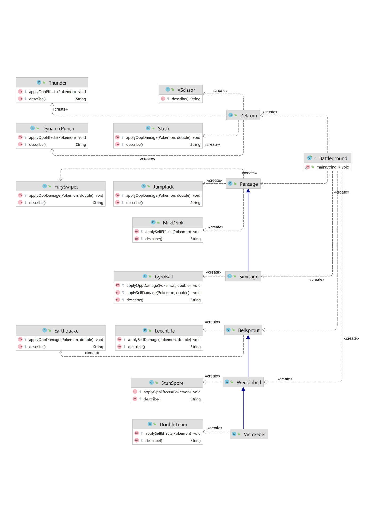

<p align="center">
  
</p>
<p align="center" style ="font-size: 24px"><em>Факультет мехатроники и робототехники</em></p>

<p align="center" style ="font-size: 24px"><strong>Лабораторная работа №2 </br>
По дисциплине : «Программирование»</br>
Вариант 52179</strong>
</p>
<p align="left">Преподаватель: <strong>Райла Мартин</strong></br>
Выполнил: <strong>Нгуен Тоан</strong></br>
Группа: <strong>R3137</strong>
</p>

# Лабораторная работа #2

## 1. Покемоны


## 2. Диаграмма классов


## 3. Исходный код

### 3.1 Battlegroup.java
```java
import Pokemons.*;
import ru.ifmo.se.pokemon.Battle;

class Battleground {
    public static void main(String[] args) {
        // Init a Battle
        Battle b = new Battle();

        // Pokemons join Battle
        Simisage p1 = new Simisage("Nguyễn Văn A", 1);
        Zekrom p2 = new Zekrom("Trần Thị B", 2);
        Weepinbell p3 = new Weepinbell("Nhốc", 3);
        Zekrom p4 = new Zekrom("Đặng Thị C", 1);
        Pansage p5 = new Pansage("Hứa Văn Hẹn", 3);
        Bellsprout p6 = new Bellsprout("Hihi", 3);

        b.addAlly(p1);
        b.addAlly(p2);
        b.addAlly(p3);
        b.addFoe(p4);
        b.addFoe(p5);
        b.addFoe(p6);

        // Fight!!!
        b.go();
    }
}
```

### 3.2 Some class in Pokemons
#### Zekrom.java
```java
package Pokemons;

import Moves.*;
import ru.ifmo.se.pokemon.*;

public class Zekrom extends Pokemon{
    
    public Zekrom(String name, int level){
        // init name and level
        super(name, level);
        // Set base stats
        setStats(100, 150, 120, 120, 100, 90);
        // init type of pokemon
        setType(Type.DRAGON, Type.ELECTRIC);
        // init move
        setMove(new XScissor(), new DynamicPunch(), new Thunder(), new Slash());
        
    }
}
```

#### Pansage.java
```java
package Pokemons;

import Moves.*;
import ru.ifmo.se.pokemon.*;

public class Pansage extends Pokemon{
    
    public Pansage(String name, int level){
        // init name and level
        super(name, level);
        // Set base stats
        setStats(50, 53, 48, 53, 48, 64);
        // init type of pokemon
        setType(Type.GRASS);
        // init move
        setMove(new JumpKick(), new FurySwipes(), new MilkDrink());
        
    }
}
```

#### Simisage.java
```java
package Pokemons;

import Moves.*;

public class Simisage extends Pansage {
    public Simisage(String name, int level){
        super(name, level);
        setStats(75, 98, 63, 98, 63, 101);
        addMove(new GyroBall());
    }
}
```

### 3.3 Some class in moves
#### Xscissor.java
```java
package Moves;

import ru.ifmo.se.pokemon.*;

public class XScissor extends PhysicalMove{
    public XScissor(){
        super(Type.BUG, 80, 100);
    }    

    @Override
    protected String describe(){
        return "Use X-Scissor";
    }
}
```

#### GyroBall.java
```java
package Moves;

import ru.ifmo.se.pokemon.*;
import Pokemons.Simisage;

public class GyroBall extends PhysicalMove {
    public GyroBall(){
        super(Type.STEEL, 0, 100);
    }

    public double seflSpeed;

    @Override
    protected void applySelfDamage(Pokemon p, double dame){
        this.seflSpeed = p.getStat(Stat.SPEED);
        super.applySelfDamage(p, dame);
    }

    @Override
    protected void applyOppDamage(Pokemon p_user, double dam){
        double k = 25 * p_user.getStat(Stat.SPEED) / this.seflSpeed;
        super.applyOppDamage(p_user, k);
    }
    
    @Override
    protected String describe(){
        return "Use Gyro Ball";
    }
}
```

#### FurySwitch.java
```java
package Moves;

import ru.ifmo.se.pokemon.*;
import java.util.Random;

public class FurySwipes extends PhysicalMove {
    public FurySwipes(){
        super(Type.NORMAL, 18, 80);
    }

    @Override
    protected void applyOppDamage(Pokemon p, double dam){
        Random random = new Random();
        int randomNumber = random.nextInt(5 - 2) + 2;
        if (randomNumber == 2){
            super.applyOppDamage(p, dam*2);
        }
        else if (randomNumber == 3){
            super.applyOppDamage(p, dam*3);
        }
        else if (randomNumber == 4){
            super.applyOppDamage(p, dam*4);
        }
        else {
            super.applyOppDamage(p, dam*5);
        }
    }

    @Override
    protected String describe(){
        return "Use Fury Swipes";
    }
}
```


